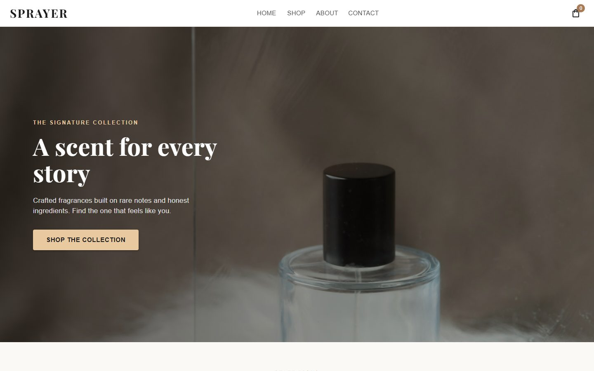
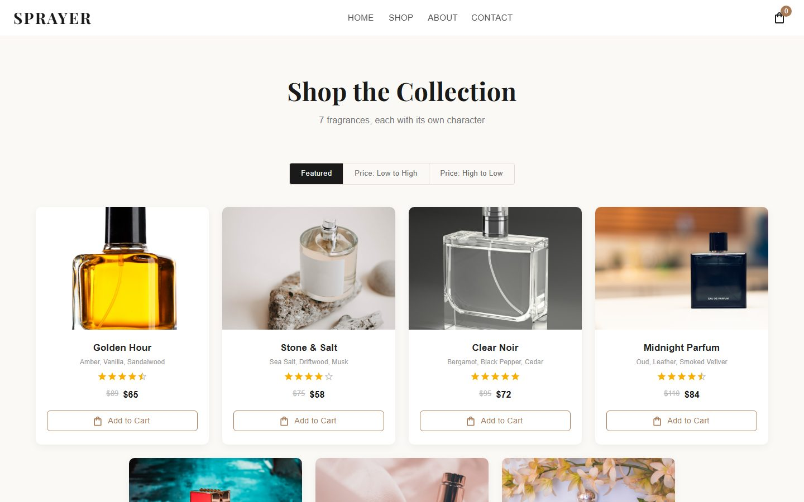
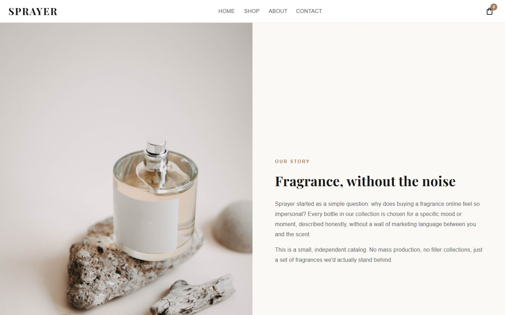
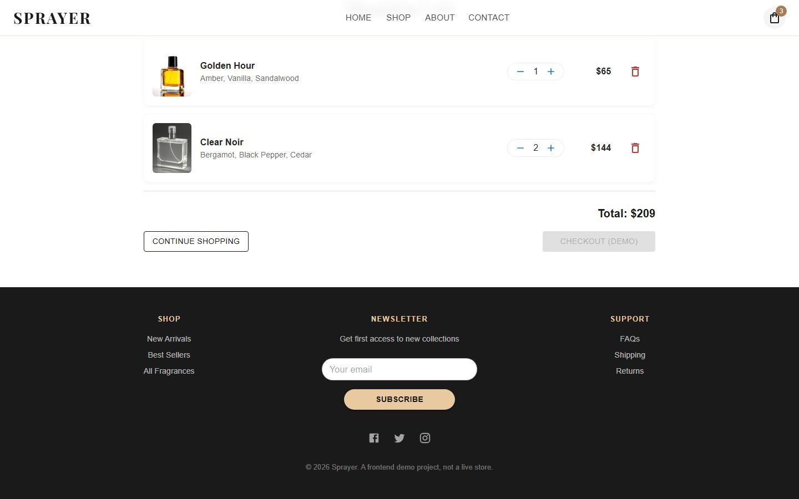

# Sprayer

A fragrance storefront frontend built with React, Vite, and MUI. Browse a collection, add items to a real shopping cart, and adjust quantities, all state-driven, not mocked.



## What this is

- A **React + Vite** frontend styled with Material UI, built to practice product-catalog UI patterns and cart state management.
- **The cart is real**: adding an item, changing quantity, removing an item, and the running total are all driven by a `CartContext` (React Context + `useState`), not a hardcoded mock. Refresh the page and it resets, since there's no backend or persistence layer.
- **No backend.** Product data lives in `src/data/products.js`. There's no database, no auth, and no payment integration, so "Checkout" is intentionally disabled with a label saying so, rather than pretending to complete an order. The Contact form is similarly simulated: it shows a success message but doesn't send anything anywhere, since there's no backend to receive it.
- All product photography is unbranded stock photography (no real perfume brand names or logos), since this is a practice project, not a real store.

## Pages

**Home** — hero banner, featured picks, full collection grid, promo strip.



**Shop** — the full catalog with sort by price.



**About** — the story behind the (fictional) store.

**Contact** — a message form (simulated submit, see above).



**Cart** — add/remove items, adjust quantity, running total.

## Tech Stack

React, Vite, Material UI (MUI), React Router

## Getting Started

```bash
npm install
npm run dev
```

Open [http://localhost:5173](http://localhost:5173).

## Project Structure

```
src/
├── Components/       # Navbar, Footer, Cart
├── Pages/            # Home, Shop, About, Contact
├── context/          # CartContext (add/remove/quantity/total)
├── data/             # Product catalog
└── assets/products/  # Unbranded stock photography
```
